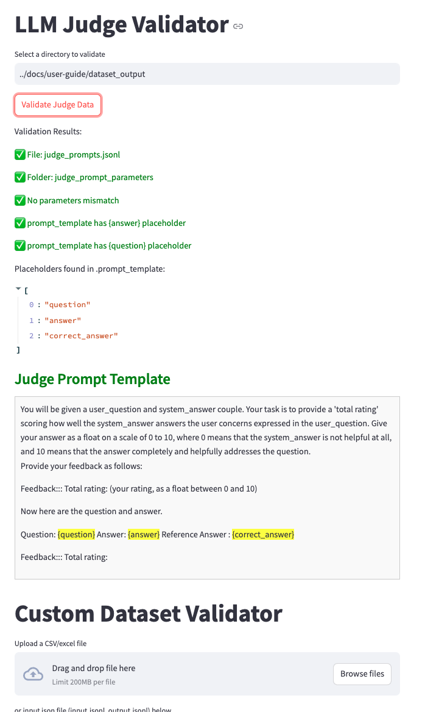
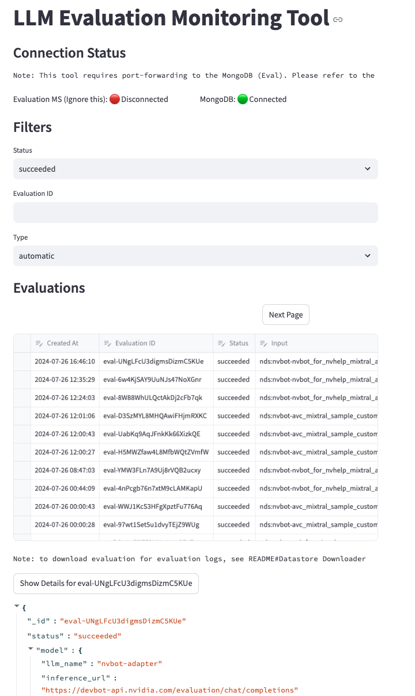

# Evaluation


## Getting started

Dependency:
nvbot-utils: [https://gitlab-master.nvidia.com/jarvis-chatbot/nvbot-utils/](https://gitlab-master.nvidia.com/jarvis-chatbot/nvbot-utils/-/packages/?orderBy=created_at&sort=desc)
always update to latest stable version!

Swagger endpoint:

[http://127.0.0.1:PORT/services/docs#/](http://127.0.0.1:6001/services/docs#/)


Build:

```
poetry config http-basic.nvbot-models nvbot-models $REGISTRY_TOKEN
poetry config http-basic.nvbot-legacy-models nvbot-legacy-models $REGISTRY_TOKEN
poetry config http-basic.nvbot-utilities nvbot-utilities $REGISTRY_TOKEN
pip3 install -r requirement.txt

```
Docker:

```
docker build --build-arg "REGISTRY_TOKEN=$REGISTRY_TOKEN" . -t eva5

docker run eva5

```

## Test and Deploy


[Deploy status](https://nvitprod.datadoghq.com/orchestration/overview/pod?query=kube_namespace%3Ans-nvbot-evaluation-%2A%20&expanded=pod_status%3Arunning&explorer-na-groups=false&groups=tag%23pod_status&highlight=%5B%5D&metric=pod.restart.count&overview-na-groups=true&palette=HostmapBlues&panel_tab=logs&pg=0&pod-overview-cols=name%2Cstatus%2Ccluster%2Cnamespace%2Cage%2Cready%2Crestarts%2Ccpu_usage_limits%2Cmemory_usage_limits&ptfu=false&resource_mode=cpu&saved-view-id=2497129)

## Onboarding steps
1. Read [Bot Evaluation Onboarding Guide](https://confluence.nvidia.com/pages/viewpage.action?spaceKey=ITAppDev&title=Bot+Evaluation+Onboarding+Guide)
2. Read [user-guide](docs/user-guide.md) to understand the evaluation types

## Monitoring
1. Evaluation Dashboard: [datadog/nvbot-answer-quality-evaluation](https://nvitprod.datadoghq.com/dashboard/4h5-fnm-cim/nvbot-answer-quality-evaluation-dashboard?fromUser=true&refresh_mode=sliding&view=spans&from_ts=1721427080841&to_ts=1722031880841&live=true)
2. Nemo Evaluation Platform Infra Dashboard: [Nemo Evaluation Platform Health](https://nvitprod.datadoghq.com/dashboard/4jg-mpe-gwb/service-evaluation-platform-health?fromUser=true&refresh_mode=sliding&view=spans&from_ts=1721427128680&to_ts=1722031928680&live=true)

## Toolings (Debugging Runs)
Below are list of toolings available for the project, for more see under [tools/README.md](tools/README.md)

#### [Dataset Validator](tools/README.md)


#### [Evaluation Runs Browser](tools/README.md)

